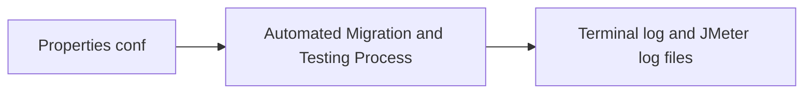
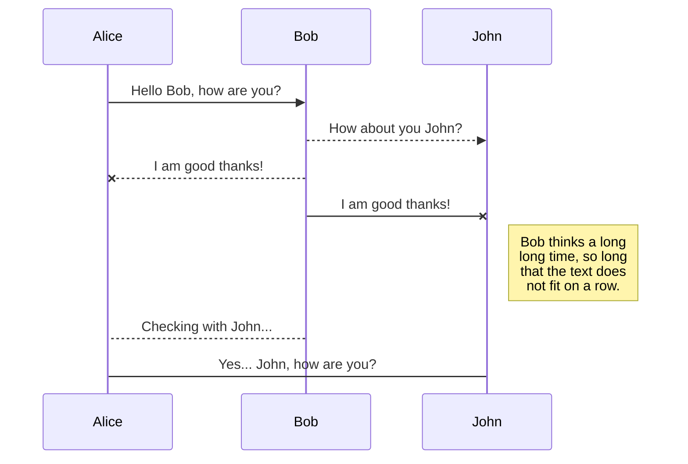
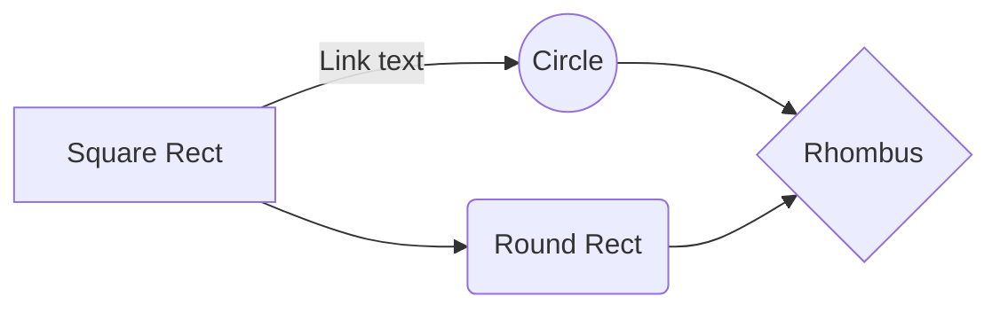

# Welcome to APIM-Automating-Migration-Testing Tool

## **Prerequisites**
-   Clone or download [this](https://github.com/YasasRangika/apim-automating-migration-testing) GitHub repository for the testing tool.
    

> If you have not installed Python 3 or above version please follow this [https://www.python.org/downloads/](https://www.python.org/downloads/) to install.

    

  

-   Choose your database type that you are going to test the API manager product with it.
    
-   It is requested to create three databases in that database type that you have selected;
    

		amdb: Databases for API Manager tables
    
		regdb: Database for registry management tables
    
		userdb: Database for user management tables
    

	-   In Oracle database no need to have these kinds of three databases
    

  

-   All the database names that you have provided when creating databases must be added to the properties file that is mentioned in the following section.
    

  

	-   Please use one all privileged user for creating above databases. Use of multiple users are not currently supported for this tool
    

  

-   Download the two API Manager versions that you want to test the migration.

## **Testing Tool**

This migration Test Automation tool is a python program (Python 3) that includes several components. To run this complete program there is shell script for Linux-based platforms and bat file for Windows-based platforms.

There is a property file named as properties.py inside the Python directory in the root directory of testing tool. All the system required information is extracted from this file. As this is the most important part of this tool, the whole next section will discuss how to feed data into it.

## **Working with Properties File**

    <Testing_tool_HOME_PATH>/Python/properties.py

This is a python file. So before feeding data to this file, you need to know how to follow basic Python syntaxes and rules given below.

 -   Do not hit any spaces or tabs before any line in the file
    
 -   Do not change any given key name
    
 -   There is a file filled with dummy data, and do not forget to parse string values inside the double inverted commas
    
 -   Commenting is done by ‘#’ sign in python.

**Give New Values and Commenting/Uncommenting in Properties File**

	   -   OLD_VERSION/TO_OLD_PATH: Chosen old/new version
	  
	   -   TO_OLD_PATH/TO_NEW_PATH: Path to the download location of the zip file
       
	   -   APIM_HOME_PATH: Choose a location to unzip files (This will be the home path for every version)
       
	   -   DB_TYPE: Uncomment given database type according to your test (Only one database type is allowed at once)
       
	   -   USER_NAME, PWD, HOST, PORT: According to the given type of database, give these values accurately (PORT is integer value)
       
	   -   AM_DB, REG_DB, USER_DB: As mentioned in prerequisites provide database names you have given to those databases (Follow the lowercase uppercase letters correctly in database names)
       
	   -   SID: This is only for Oracle database
       
	   -   IS_CURRENT_VERSION/IS_MIGRATE_VERSION: Identity server versions those are required for given previous and new versions of API Manager products
       
	   -   JAVA_HOME: Java home path if it is not set as a path variable

## **Manually Adding Required Resources for The Testing Tool**

    Do not remove any file comes with the testing tool except adding new required files.
There are three directories named API-M_2.1.0, API-M_2.2.0, API-M_2.5.0 in `<Testing_tool_HOME_PATH>/data` directory. These directories include edited registry.xml file that required to replace with original file came up among API Manager package for mounting registries.  
If the new version you are going to test is not in this list you need to manually add it to this kind of directory. For that follow [https://docs.wso2.com/display/AM210/Installing+and+Configuring+the+Databases](https://docs.wso2.com/display/AM210/Installing+and+Configuring+the+Databases)(see the AM version you want) steps in the section “To enable access to the registry database” to build registry.xml. When naming the directory please follow this pattern;  
API-M_<APIM_VERSION>

## Rename a file

You can rename the current file by clicking the file name in the navigation bar or by clicking the **Rename** button in the file explorer.

## Delete a file

You can delete the current file by clicking the **Remove** button in the file explorer. The file will be moved into the **Trash** folder and automatically deleted after 7 days of inactivity.

## Export a file

You can export the current file by clicking **Export to disk** in the menu. You can choose to export the file as plain Markdown, as HTML using a Handlebars template or as a PDF.

# Synchronization

Synchronization is one of the biggest features of StackEdit. It enables you to synchronize any file in your workspace with other files stored in your **Google Drive**, your **Dropbox** and your **GitHub** accounts. This allows you to keep writing on other devices, collaborate with people you share the file with, integrate easily into your workflow... The synchronization mechanism takes place every minute in the background, downloading, merging, and uploading file modifications.

There are two types of synchronization and they can complement each other:

- The workspace synchronization will sync all your files, folders and settings automatically. This will allow you to fetch your workspace on any other device.
	> To start syncing your workspace, just sign in with Google in the menu.

- The file synchronization will keep one file of the workspace synced with one or multiple files in **Google Drive**, **Dropbox** or **GitHub**.
	> Before starting to sync files, you must link an account in the **Synchronize** sub-menu.

## Open a file

You can open a file from **Google Drive**, **Dropbox** or **GitHub** by opening the **Synchronize** sub-menu and clicking **Open from**. Once opened in the workspace, any modification in the file will be automatically synced.

## Save a file

You can save any file of the workspace to **Google Drive**, **Dropbox** or **GitHub** by opening the **Synchronize** sub-menu and clicking **Save on**. Even if a file in the workspace is already synced, you can save it to another location. StackEdit can sync one file with multiple locations and accounts.

## Synchronize a file

Once your file is linked to a synchronized location, StackEdit will periodically synchronize it by downloading/uploading any modification. A merge will be performed if necessary and conflicts will be resolved.

If you just have modified your file and you want to force syncing, click the **Synchronize now** button in the navigation bar.

> **Note:** The **Synchronize now** button is disabled if you have no file to synchronize.

## Manage file synchronization

Since one file can be synced with multiple locations, you can list and manage synchronized locations by clicking **File synchronization** in the **Synchronize** sub-menu. This allows you to list and remove synchronized locations that are linked to your file.

# Publication

Publishing in StackEdit makes it simple for you to publish online your files. Once you're happy with a file, you can publish it to different hosting platforms like **Blogger**, **Dropbox**, **Gist**, **GitHub**, **Google Drive**, **WordPress** and **Zendesk**. With [Handlebars templates](http://handlebarsjs.com/), you have full control over what you export.

> Before starting to publish, you must link an account in the **Publish** sub-menu.

## Publish a File

You can publish your file by opening the **Publish** sub-menu and by clicking **Publish to**. For some locations, you can choose between the following formats:

- Markdown: publish the Markdown text on a website that can interpret it (**GitHub** for instance),
- HTML: publish the file converted to HTML via a Handlebars template (on a blog for example).

## Update a publication

After publishing, StackEdit keeps your file linked to that publication which makes it easy for you to re-publish it. Once you have modified your file and you want to update your publication, click on the **Publish now** button in the navigation bar.

> **Note:** The **Publish now** button is disabled if your file has not been published yet.

## Manage file publication

Since one file can be published to multiple locations, you can list and manage publish locations by clicking **File publication** in the **Publish** sub-menu. This allows you to list and remove publication locations that are linked to your file.

# Markdown extensions

StackEdit extends the standard Markdown syntax by adding extra **Markdown extensions**, providing you with some nice features.

> **ProTip:** You can disable any **Markdown extension** in the **File properties** dialog.

## SmartyPants

SmartyPants converts ASCII punctuation characters into "smart" typographic punctuation HTML entities. For example:

|                |ASCII                          |HTML                         |
|----------------|-------------------------------|-----------------------------|
|Single backticks|`'Isn't this fun?'`            |'Isn't this fun?'            |
|Quotes          |`"Isn't this fun?"`            |"Isn't this fun?"            |
|Dashes          |`-- is en-dash, --- is em-dash`|-- is en-dash, --- is em-dash|

## KaTeX

You can render LaTeX mathematical expressions using [KaTeX](https://khan.github.io/KaTeX/):

The *Gamma function* satisfying $\Gamma(n) = (n-1)!\quad\forall n\in\mathbb N$ is via the Euler integral

$$
\Gamma(z) = \int_0^\infty t^{z-1}e^{-t}dt\,.
$$

> You can find more information about **LaTeX** mathematical expressions [here](http://meta.math.stackexchange.com/questions/5020/mathjax-basic-tutorial-and-quick-reference).

## UML diagrams

You can render UML diagrams using [Mermaid](https://mermaidjs.github.io/). For example, this will produce a sequence diagram:

And this will produce a flow chart:

